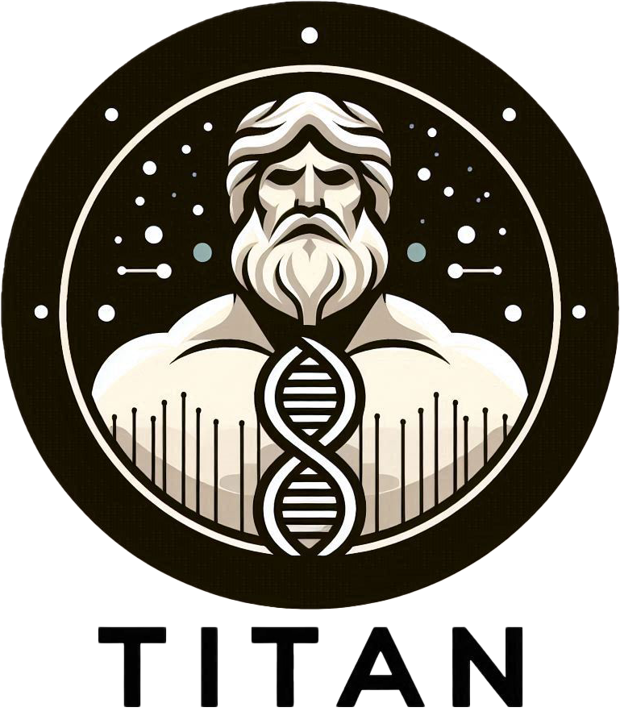
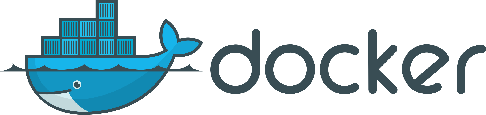
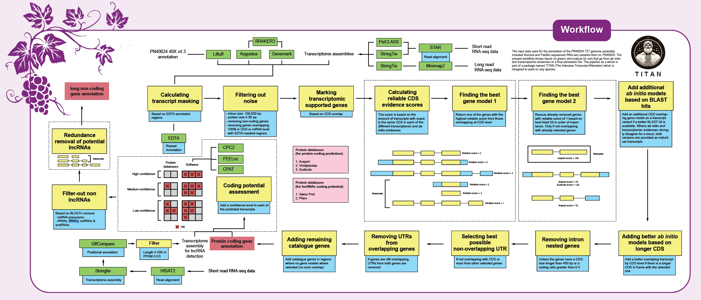

Workflows
=========

**TITAN** (**T**\ he **I**\ ntensive **T**\ ranscript **AN**\ notation pipeline)
--------------------------------------------------------------------------------

Installation
^^^^^^^^^^^^

.. image:: _static/Nextflow_logo.png
    :width: 49 %

First, you have to clone the pipeline repository from git:

.. code-block:: bash

  git clone https://github.com/Grapedia/workflows.git

The TITAN annotation pipeline is in the folder workflows/TITAN

.. note::
  Git can be installed from `Git website <https://git-scm.com/downloads>`_ 

The pipeline only requires docker to be installed. All the tools used by the pipeline are available as docker images at https://quay.io/biocontainers/ or at https://hub.docker.com/.

.. note::

  To install Docker, follow the instructions `here <https://docs.docker.com/get-docker/>`_ for Docker desktop (Mac/Windows/Linux), or if you are on Linux you can install also Docker engine, following the instructions `here <https://docs.docker.com/engine/install/>`_

Also, to launch the pipeline, Nextflow must be installed on your computer/server following these `instructions <https://www.nextflow.io/docs/latest/install.html>`_

With the workflows/TITAN, Nextflow and docker installed, you can simply run the TITAN pipeline after data preparation (see next section).

Data preparation
^^^^^^^^^^^^^^^^

File structure to be prepared :

.. code-block:: bash

  ├── data
  │   ├── annotations
  │   ├── assemblies
  │   ├── protein_data
  │   └── RNAseq_data

In the workflows/TITAN folder, you can create a "data" folder containing all the data needed by TITAN to run.

**data/annotations** : contains the previous annotation in GFF3 format (eg : Vitis_vinifera_gene_annotation_on_V2_20.gff3)

**data/assemblies** : contains previous assembly (eg PN12Xv2.fasta) and new assembly (eg Chinese_ref_v2.fa)

**data/protein_data** : contains all the protein data files (FASTA) to perform protein alignments. Contains also a samplesheet describing the protein data file to use.

          Example :

          .. code-block:: bash
  
            organism,filename
            viridiplantae,Viridiplantae_swissprot.fasta
            eudicotyledones_orthoDB,eudicotyledons_odb10.fasta

.. warning::

  This Samplesheet is used by BRAKER3 and Aegis. For Aegis, the order of the lines is important. For example, in this example, viridiplantae will be most important as eudicotyledones_orthoDB. So order the proteins according to their importance here.

**data/RNAseq_data** : contains all the RNAseq data for transcriptome assembly. Contains also the RNAseq_samplesheet. If FASTQ, the fastq file must be in the right folder, if SRA, the workflow will download the SRA file and convert it to fastq.gz file.

          Example of RNAseq_samplesheet :

          .. code-block:: bash

            sampleID,SRA_or_FASTQ,library_layout
            ERR1059552,FASTQ,paired
            ERR1059553,FASTQ,paired
            ERR1059554,SRA,paired
            ERR1059555,SRA,paired
            SRR5435969,FASTQ,paired
            SRR8775072,FASTQ,paired
            SRR3046429,SRA,paired
            SRR3046438,SRA,paired
            SRR520373,SRA,single
            SRR17318658,SRA,long

The sampleID correspond to the SRR ID for SRA or the file ID for FASTQ. The SRA_or_FASTQ can take two possible values, "SRA" and "FASTQ". If the value is SRA, TITAN will donwload the file from public database, else the FASTQ filein .gz format must be in data/RNAseq_data. Then, the library_layout column can take three different values : "single" (if sample si single-end), "paired" (if sample is paired-end) or "long" (if sample is long reads).

.. warning::

  In data/RNAseq_data, for the FASTQ files, the name need to be ${sampleID}.fastq.gz for single-end and ${sampleID}_1.fastq.gz and ${sampleID}_2.fastq.gz for paired-end.

.. warning::

  In data/RNAseq_data, stranded short reads are mandatory, and unstranded short reads and long reads are optional. Also, if there is no library_layout as "long" in the RNAseq_samplesheet, this is not a problem. Don't forget to put the right parameters in nextflow.config : use_long_reads = false // true or false

Launch the pipeline
^^^^^^^^^^^^^^^^^^^

Before launching the pipeline, fill in the configuration file called “nextflow.config” in the “workflows/TITAN” folder.

  nextflow.config file

.. code-block:: bash

  // Manifest section: Defines metadata about the pipeline
  manifest {
    author = 'David Navarro (david.navarro.paya@gmail.com), Antonio Santiago (antsanpaj@gmail.com), Amandine Velt (amandine.velt@inrae.fr)'
    name = 'TITAN (The Intensive Transcript ANnotation pipeline)'
    version = '1.0'
    description = 'Gene annotation pipeline'
    homePage = 'https://github.com/Grapedia/workflows/tree/main/TITAN'
    nextflowVersion = '24.04.3'
    mainScript = 'main.nf'
  }
  
  // Docker section: Enables containerization using Docker
  docker {
    enabled = true
  }
  
  // Process settings: Defines resource allocation for processes
  process {
    withName: 'aegis_short_reads' {
      memory = '300GB'
      cpus = 1
      containerOptions = "-v /data2/avelt/2024_assembly_GW_RI_hifiasm/Riesling/2025_genes_annotation/workflows/TITAN:/data2/avelt/2024_assembly_GW_RI_hifiasm/Riesling/2025_genes_annotation/workflows/TITAN"
    }
  
    withName: 'aegis_long_reads' {
      memory = '300GB'
      cpus = 1
      containerOptions = "-v /data2/avelt/2024_assembly_GW_RI_hifiasm/Riesling/2025_genes_annotation/workflows/TITAN:/data2/avelt/2024_assembly_GW_RI_hifiasm/Riesling/2025_genes_annotation/workflows/TITAN"
    }
  
    // Default configuration for all other processes
    withLabel: 'default' {
      memory = '40GB'
      cpus = 10
      containerOptions = "-v /data2/avelt/2024_assembly_GW_RI_hifiasm/Riesling/2025_genes_annotation/workflows/TITAN:/data2/avelt/2024_assembly_GW_RI_hifiasm/Riesling/2025_genes_annotation/workflows/TITAN"
    }
  
  }
  
  // Parameters section: Defines user-configurable parameters
  params {
    workflow = "generate_evidence_data" // possible value : generate_evidence_data, aegis or all
    output_dir = "$projectDir/OUTDIR"
    previous_assembly = "$projectDir/data/assemblies/T2T_ref.fasta"
    new_assembly = "$projectDir/data/assemblies/riesling.hap1.chromosomes.phased.fa"
    previous_annotations = "$projectDir/data/annotations/PN40024_5.1_on_T2T_ref_with_names.gff3"
    RNAseq_samplesheet = "$projectDir/data/RNAseq_data/RNAseq_samplesheet.txt"
    protein_samplesheet = "$projectDir/data/protein_data/samplesheet.csv"
    EDTA = "yes" // Whether to run EDTA (transposable element annotation tool) - "yes" or "no"
    use_long_reads = false // Flag to indicate whether long-read sequencing data should be used (true/false)
  }

.. note::

  The $projectDir variable is the absolute path to the "workflows/TITAN folder. If you have correctly followed the folders/files structure creation that is mandatory and suggested in the data preparation section, you only need to modify the file names and not the paths to these files.

Once the data has been correctly prepared and the configuration file completed, simply launch the Nextflow pipeline directly in the workflows/TITAN folder.

.. code-block:: bash

  nextflow run main.nf -with-dag dag.png -with-trace -with-timeline -with-report

TITAN workflow
^^^^^^^^^^^^^^^^^^^

